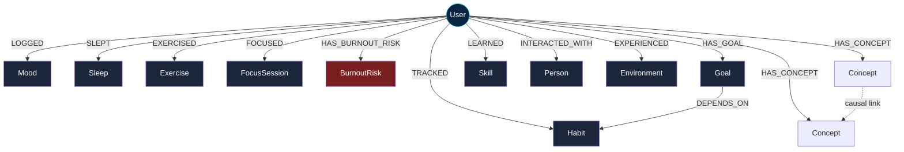
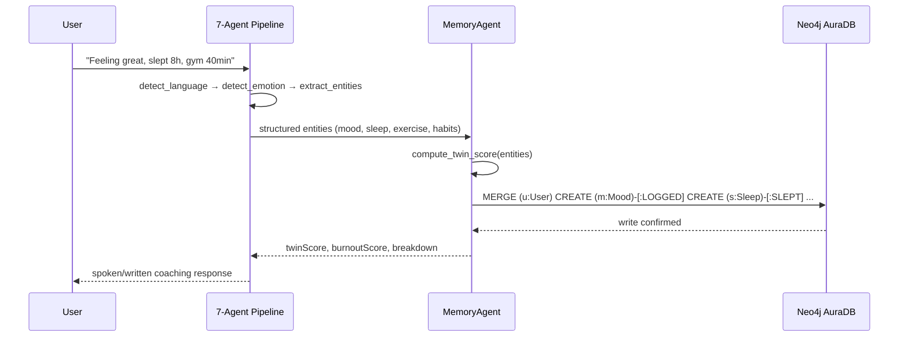
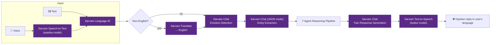
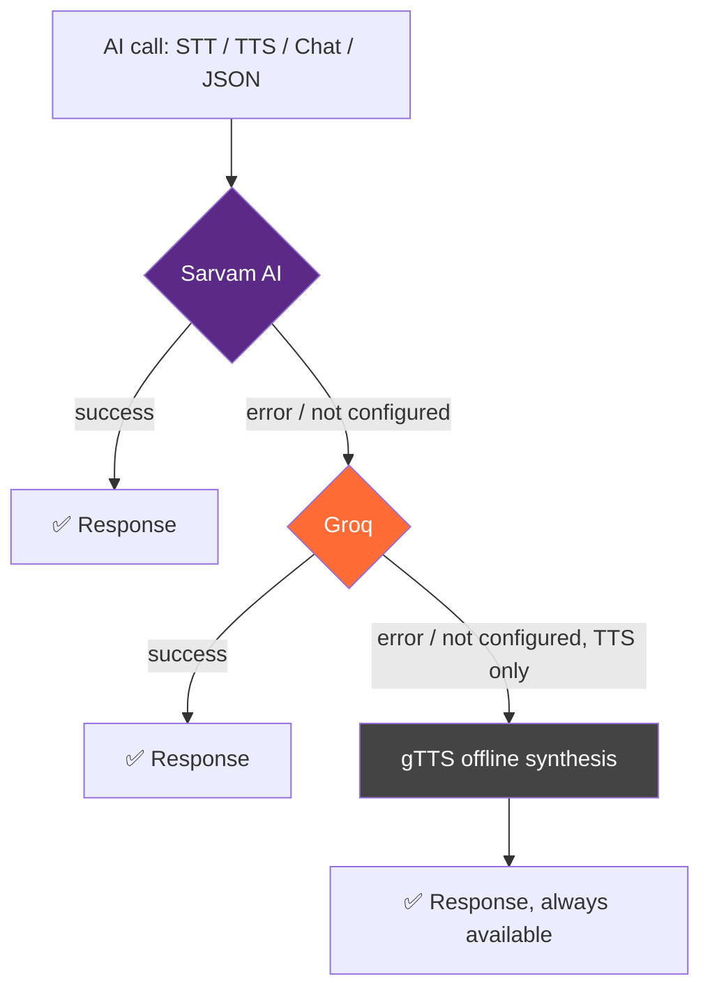
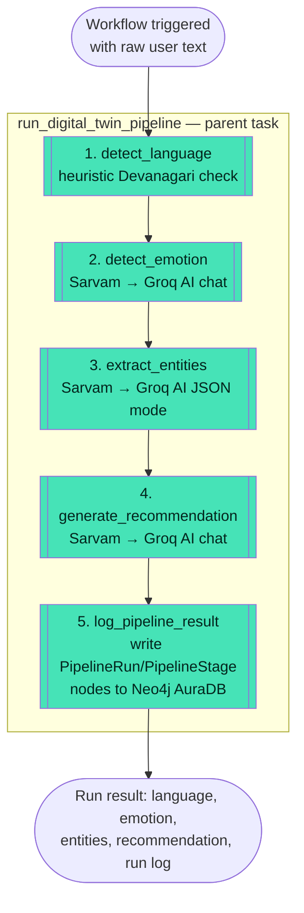

# 🧠 SynapseTwin — Your AI Digital Twin

> Built for HACKHAZARDS '26 | NAMESPACE Community


---

## 🚀 What is SynapseTwin?

SynapseTwin is an **AI Digital Twin** — a living graph model of a person's mood,
sleep, exercise, work, habits, goals, and environment. You talk or type to it in
any Indian language, it reasons about what changed in your life, remembers it as
a **connected knowledge graph** in Neo4j AuraDB, reasons over that graph to
find causal patterns ("your focus drops on days you skip exercise"), and speaks
back a coaching response through Sarvam AI's voice stack.

It's not a chatbot with a database bolted on. The graph *is* the product:
every screen — the dashboard, the habit tracker, the "why am I burning out"
insight, the causal-chain view — is a live Cypher query result, not a cached
blob.

---

## 🏆 Sponsor Track Alignment

| Track | Requirement | How SynapseTwin qualifies |
|---|---|---|
| **Neo4j AuraDB** | AuraDB as the primary/only data layer; graph modeling central to backend; real queries power real features | ✅ AuraDB is the **only** datastore (no Postgres/Mongo). 10+ node labels, 12+ relationship types, 85+ live Cypher statements. See [§ Neo4j AuraDB](#-neo4j-auradb--the-graph-is-the-product). |
| **Sarvam AI** | Core product functionality relies on Sarvam APIs; live AI interactions | ✅ Sarvam AI is the **primary** provider for STT, TTS, translation, language detection, and all chat/JSON reasoning across every agent. See [§ Sarvam AI](#-sarvam-ai--the-primary-ai-provider). |
| **Render Workflows** | Multi-stage connected workflow; meaningful work beyond a simple deploy; demonstrated via live Render deployment | ✅ The 5-agent Digital Twin pipeline is deployed as a genuine chained Render Workflow (separate `render-workflows/` service) with per-stage logging back into the same AuraDB graph. See [§ Render Workflows](#-render-workflows--multi-stage-pipeline-orchestration). |

---

## ✨ Features

- 🎤 **Voice-first, multilingual** — speak in Hindi, Tamil, Telugu, Bengali, Marathi, Kannada, English, and more
- 🧠 **7-agent reasoning pipeline** — Memory, Health, Productivity, Learning, Habit, Reflection, Recommendation agents run on every input
- 🕸️ **Knowledge graph memory** — every mood, sleep hour, workout, habit, goal, and interaction becomes a node connected to `User`
- 🔗 **Causal-chain discovery** — real Cypher queries surface "sleep → mood" and "exercise → focus" correlations, not hardcoded rules
- 🩺 **Burnout & Twin Score engine** — a weighted composite score computed from live graph state
- 🏢 **Enterprise mode** — manager dashboards aggregate team wellness straight from the graph
- 🌦️ **Environment awareness** — weather/location/commute logged as graph nodes and correlated with mood
- 📚 **Adaptive learning recommendations** — Coursera/Udemy suggestions generated from AI analysis of skill gaps
- ⚙️ **Graceful multi-provider fallback** — Sarvam → Groq → gTTS, so the demo never goes dark mid-judging

---

## 🕸️ Neo4j AuraDB — The Graph *Is* the Product

AuraDB isn't a side cache here — it is the **only** database in SynapseTwin, and
it is central to the backend architecture: the entire pipeline exists to turn
raw text/voice into graph nodes and relationships, and every read-facing feature
is a Cypher query, not an ORM call over rows.

### Graph data model



All date-bearing nodes (`Mood`, `Sleep`, `Exercise`, `FocusSession`,
`BurnoutRisk`) use Neo4j's native `Date` type, so time-window reasoning
(`date() - duration({days:7})`) runs natively in Cypher — not in application
code.

### The write path: one conversation → one graph transaction



### Real, non-trivial Cypher powering real features

These are excerpted directly from `app/services/neo4j_service.py` — not
illustrative pseudo-queries:

**1. Causal pattern discovery** (drives the "Insights" and "Causal Chain" screens):
```cypher
// Does good sleep actually correlate with better mood for this user?
MATCH (u:User {id:$userId})-[:SLEPT]->(s:Sleep),
      (u)-[:LOGGED]->(m:Mood {date:s.date})
WHERE s.hours >= 7
RETURN avg(m.score) AS avgMoodWithGoodSleep,
       avg(s.hours) AS avgSleepHours
```

```cypher
// Does exercise on a given day predict more focused work that day?
MATCH (u:User {id:$userId})-[:EXERCISED]->(e:Exercise),
      (u)-[:FOCUSED]->(f:FocusSession {date:e.date})
RETURN avg(f.hours) AS avgFocusWithExercise
```

**2. Burnout-relevant habit decay** (habits silently going stale):
```cypher
MATCH (u:User {id:$userId})-[:TRACKED]->(h:Habit)
WHERE h.lastDone < toString(date() - duration({days:3}))
RETURN h.name AS name, h.streak AS streak
ORDER BY h.streak DESC
```

**3. Stalled-goal detection** (goals with <10% progress created before this month):
```cypher
MATCH (u:User {id:$userId})-[:HAS_GOAL]->(g:Goal)
WHERE g.progress < 10 AND g.createdAt < $cutoff
RETURN g.title AS title, g.progress AS progress, g.category AS category
```

**4. Knowledge-graph visualization endpoint** (`/api/graph/data`) — builds the
force-directed graph you see on the "Graph" screen by walking `User` outward
through every relationship type and any causal/goal↔habit edges, deduplicated
into a single node/link payload the frontend renders live.

**5. Enterprise rollups** — manager dashboards (`/api/enterprise/summary/{team}`)
aggregate `twinScore`/`burnoutScore` across every `User` on a `Team` directly
via graph traversal, with no separate analytics store.

### Why relationships — not storage — drive the product

- The **Twin Score** isn't a stored constant recomputed by a cron job; it's
  produced by `compute_twin_score()` from the graph's own recent `Mood` /
  `Sleep` / `Exercise` / `FocusSession` nodes each time new data lands.
- The **causal-chain feature** literally cannot exist without relationships —
  it is graph pattern matching (`(u)-[:SLEPT]->(s)`, `(u)-[:LOGGED]->(m {date:s.date})`)
  finding co-occurring subgraphs, not a SQL `JOIN` afterthought.
- **Habit → Goal** edges (`DEPENDS_ON`) let the app answer "which habits are
  blocking which goals" as a one-hop traversal.
- The full node/relationship catalog: `User`, `Mood`, `Sleep`, `Exercise`,
  `FocusSession`, `BurnoutRisk`, `Habit`, `Goal`, `Skill`, `Person`,
  `Environment`, `Concept`, connected via `LOGGED`, `SLEPT`, `EXERCISED`,
  `FOCUSED`, `HAS_BURNOUT_RISK`, `TRACKED`, `HAS_GOAL`, `LEARNED`,
  `INTERACTED_WITH`, `EXPERIENCED`, `HAS_CONCEPT`, `DEPENDS_ON`.

---

## 🗣️ Sarvam AI — The Primary AI Provider

Sarvam AI is the **default, first-attempted** provider for every AI-powered
capability in SynapseTwin — speech-to-text, text-to-speech, translation,
language detection, and all LLM chat/JSON reasoning that drives the 7-agent
pipeline. Nothing about the product's core experience works without an AI
call, and Sarvam is the call that's tried first every time.

### Where Sarvam AI sits in the request path



### Provider fallback chain (why the demo never breaks on stage)

Every AI call goes through a single orchestration point
(`app/services/sarvam.py`) that tries **Sarvam first**, only falling back if
Sarvam is unreachable or unconfigured — Sarvam integration stays central even
when a fallback fires:



### Sarvam APIs actually integrated

| Capability | Sarvam endpoint | Used by |
|---|---|---|
| Speech-to-Text | `saarika` STT API | `/api/voice/stt`, voice journaling |
| Text-to-Speech | `bulbul` TTS API | `/api/voice/tts`, spoken twin responses |
| Translation | Sarvam Translate API | Any non-English input → English before reasoning |
| Language Detection | Sarvam Language ID API | Auto-detects the 10+ Indian languages supported |
| Chat / Reasoning | Sarvam chat completions | Emotion detection, entity extraction, twin response generation, learning advice |
| Structured JSON analysis | Sarvam chat (JSON mode) | Course recommendations, causal-chain reasoning inputs |

### Why this is more than "an API call"

- **Every** turn of the product — not just a demo screen — passes through
  Sarvam: language detection → translation → emotion → entity extraction →
  response generation → speech synthesis is a single Sarvam-first chain, not
  an optional add-on feature.
- Sarvam's outputs directly become **graph writes**: `detect_emotion` and
  `extract_entities` results are exactly the `Mood`, `Sleep`, `Exercise`,
  `Habit` payloads written into AuraDB — Sarvam AI is the bridge between raw
  human language and structured graph data.
- The multilingual voice loop (STT → translate → reason → TTS, all Sarvam) is
  demonstrable live: speak in Hindi, get a spoken Hindi-appropriate coaching
  reply back.

---

## ⚙️ Render Workflows — Multi-Stage Pipeline Orchestration

The 7-agent reasoning pipeline that turns one journal entry into a graph
update is genuinely multi-stage. For the Render Workflows track, that same
reasoning pipeline is deployed as a **real Render Workflow service**
(`render-workflows/`) — a separate, independently deployable codebase built
against Render's actual Workflows SDK, so the orchestration is demonstrated
live on Render's infrastructure rather than simulated in-process.

### Why a separate service

Render Workflows are a distinct Render product/service type (`New → Workflow`
in the Render Dashboard, not `Web Service`), deployed from their own
repository. `render-workflows/` is that standalone repository, ready to push
and deploy independently alongside the main SynapseTwin API — while still
writing its results into the **same AuraDB graph** the main app uses.

### Workflow structure — 5 connected, individually-retryable tasks



Each numbered stage is registered as its own first-class `@app.task` — visible,
individually triggerable, and independently retryable from the Render
Dashboard — while the parent task chains them into one connected execution,
exactly matching Render's documented task-chaining pattern.

### What each run actually does (not a no-op wrapper)

| Stage | Real work performed |
|---|---|
| `detect_language` | Script detection over the raw input |
| `detect_emotion` | Live AI call (Sarvam, Groq fallback) — sentiment, stress signals |
| `extract_entities` | Live AI call, structured JSON — mood/sleep/exercise/habits/goals |
| `generate_recommendation` | Live AI call — personalized coaching text |
| `log_pipeline_result` | Live Cypher write to Neo4j AuraDB — `PipelineRun` + `PipelineStage` nodes linked to the `User`, so every workflow execution is itself part of the knowledge graph |

That's 3 real AI reasoning calls plus 1 graph-database write per run — meaningful
work well beyond a deploy-and-ping health check.

### Evidence of execution

- **Render Dashboard** shows each triggered run's status, duration, and
  per-stage logs (standard Workflow service behavior).
- **Neo4j AuraDB** independently records every run as `PipelineRun` /
  `PipelineStage` nodes connected to the triggering `User` — so a run's
  history is queryable in Cypher even outside the Render Dashboard:
  ```cypher
  MATCH (u:User {id:$userId})-[:RAN_WORKFLOW]->(r:PipelineRun)-[:HAS_STAGE]->(s:PipelineStage)
  RETURN r.id, r.createdAt, collect({name:s.name, ms:s.ms, status:s.status}) AS stages
  ORDER BY r.createdAt DESC
  ```
- `render-workflows/trigger_client.py` shows how any client (including the
  main SynapseTwin API) triggers a run via Render's `Render`/`RenderAsync` SDK
  clients and awaits its result.

### Deploying it

Full step-by-step instructions live in [`render-workflows/README.md`](render-workflows/README.md):

1. Push `render-workflows/` to its own GitHub repo.
2. Render Dashboard → **New → Workflow** → connect that repo.
3. Build: `pip install -r requirements.txt` · Start: `python main.py`
4. Set env vars from `render-workflows/.env.example` (same AuraDB + AI keys as the main app).
5. Trigger a run and capture the Dashboard's execution log as submission evidence.

---

## 🛠️ Tech Stack

### Backend
- **Python 3.11 + FastAPI** — async API server (`app/main.py`)
- **Neo4j AuraDB** — sole datastore; official `neo4j` async Python driver
- **Sarvam AI** — primary provider for STT, TTS, translation, language ID, chat
- **Groq** — fallback LLM/voice provider (Whisper STT, PlayAI TTS, Llama chat)
- **gTTS** — final offline TTS fallback so voice output never fully fails
- **Render Workflows** (`render_sdk`) — standalone multi-stage pipeline service
- **OpenWeather API** — environment/weather correlation data
- **PyJWT + Passlib(bcrypt)** — auth for individual users and enterprise managers
- **SlowAPI** — rate limiting

### Frontend
- Server-rendered HTML/CSS/JS (`frontend/`) — dashboard, voice, insights,
  graph visualization, learning, environment, enterprise, onboarding, profile

---

## 📁 Project Structure

```
app/
├── main.py                  # FastAPI app, routing, health check, static frontend
├── db/
│   └── neo4j_db.py           # Async Neo4j driver + run_query() helper
├── services/
│   ├── neo4j_service.py      # All Cypher — the graph data layer
│   ├── sarvam.py              # Sarvam-primary / Groq-fallback orchestration
│   ├── groq_service.py        # Groq API calls (fallback provider)
│   ├── agent.py                # 7-agent reasoning pipeline
│   └── twin_score.py           # Twin Score / burnout scoring engine
├── routes/                   # voice, agent, goals, insights, graph, learning,
│                              # environment, enterprise, users, memory, notifications
└── middleware/auth.py         # JWT auth middleware

render-workflows/             # STANDALONE Render Workflows service (own repo/deploy)
├── main.py                    # 5-stage chained workflow tasks
├── ai_providers.py             # Self-contained Sarvam→Groq chat helper
├── neo4j_logger.py              # Writes PipelineRun/PipelineStage nodes to AuraDB
├── trigger_client.py             # Example: trigger a run from an external app
└── README.md                      # Deploy instructions for this service

frontend/                     # Static HTML/CSS/JS UI
```

---

## 🔐 Environment Variables

| Variable | Purpose |
|---|---|
| `NEO4J_URI`, `NEO4J_USERNAME`, `NEO4J_PASSWORD` | AuraDB connection |
| `SARVAM_API_KEY` | Sarvam AI (primary provider) |
| `GROQ_API_KEY` | Groq (fallback provider) |
| `OPENWEATHER_API_KEY` | Environment/weather correlation |
| `SESSION_SECRET` | JWT signing secret |

## ▶️ Running Locally

```bash
pip install -r requirements.txt
uvicorn app.main:app --host 0.0.0.0 --port 3000 --reload
```

Health check: `GET /api/health` reports the configured status of Neo4j, Sarvam,
Groq, OpenWeather, and the active TTS fallback.

## 🚀 Deploying on Render

The main API deploys as a standard Render **Web Service**:
- Build Command: `pip install -r requirements.txt`
- Start Command: `uvicorn app.main:app --host 0.0.0.0 --port $PORT`
- Environment variables: as listed above

The pipeline-as-a-workflow deploys separately as a Render **Workflow** service —
see [`render-workflows/README.md`](render-workflows/README.md).
